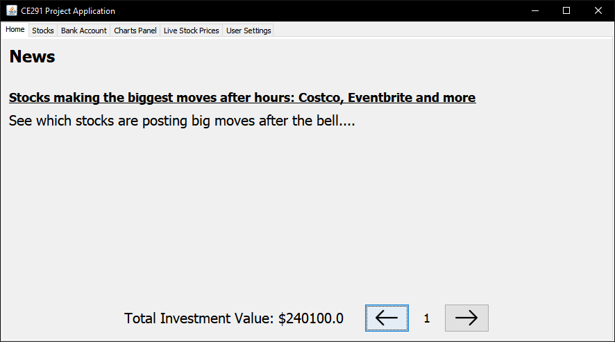
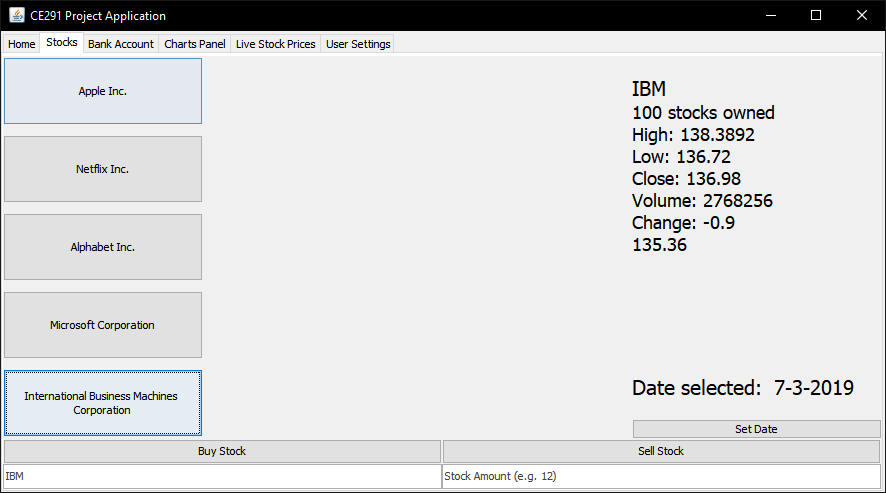
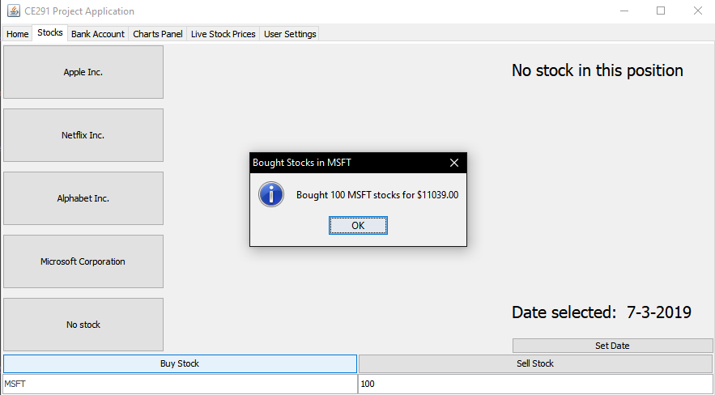
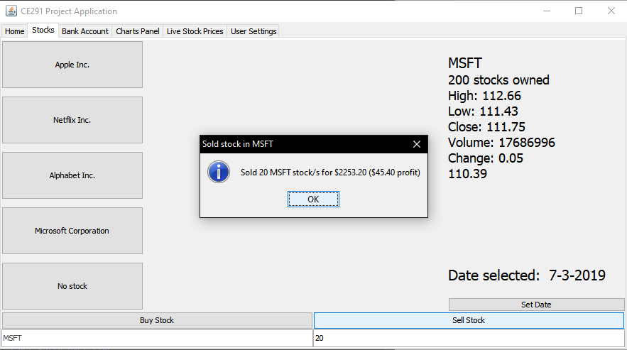
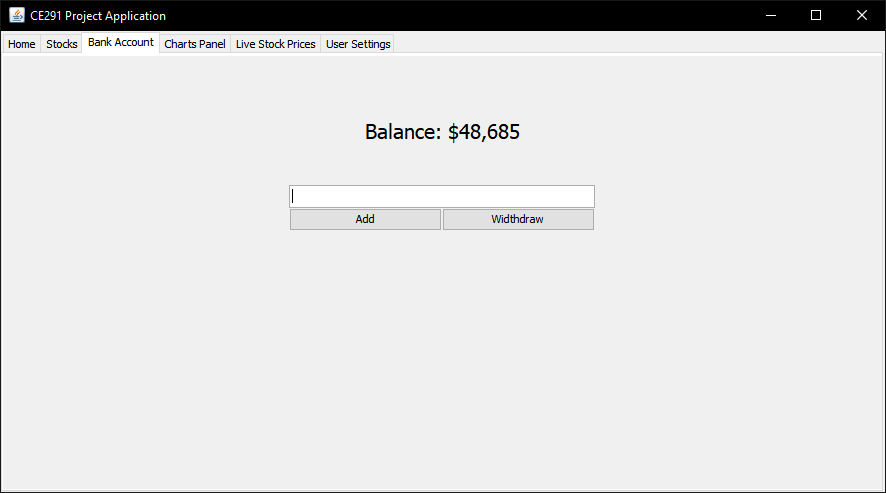
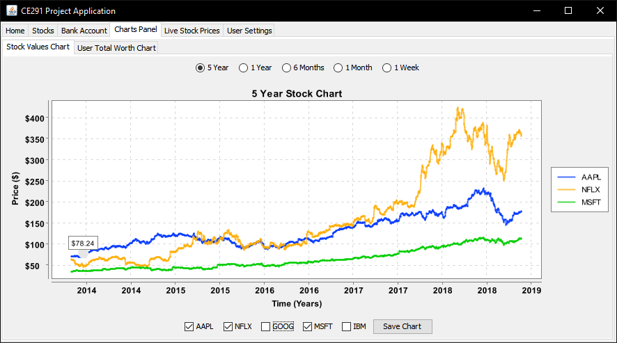
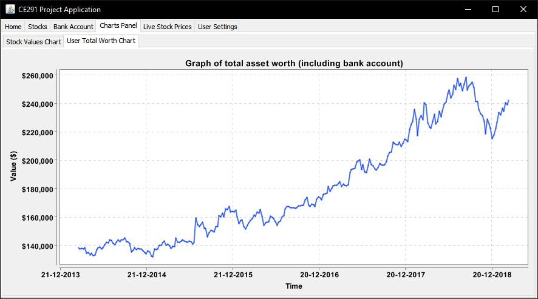
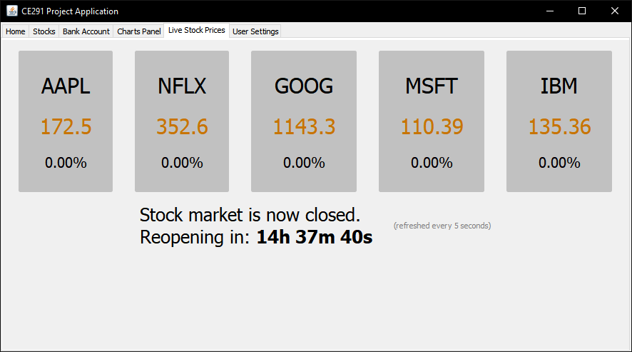
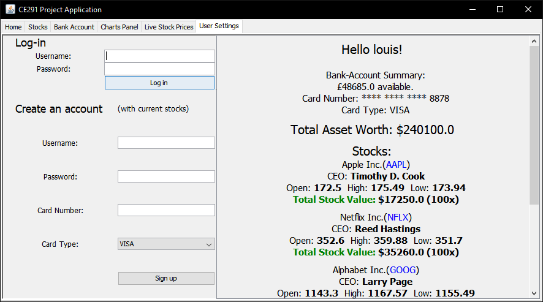
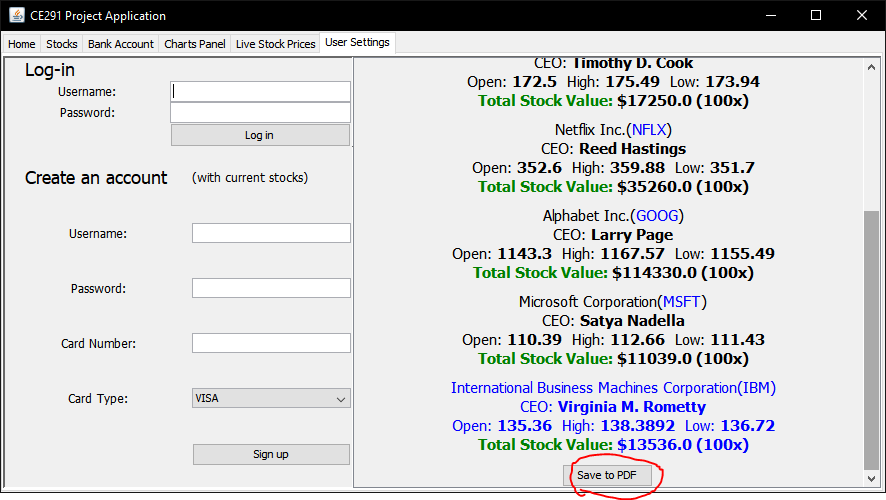

# Stock Market Portfolio Application.
## About the application.
The task for my second year project at Univeristy of Essex was to, with my team, build a stock portfolio management application that takes real-time prices from the IEX API, as well as historical information to enable graphing of the data and to allow the user to choose when they have bought / sold stocks to see actual profits/losses. 

The program is built in Java using Java Swing to allow us to create a user interface. Some features include:
1. Real-time news from RSS feeds.
2. Simulating buying/selling stocks & estimating profit.
3. Graphing of the last 5 years of owned stock information & user worth.
4. Live price panel to see the % gain/loss in real time for all owned stocks. 
5. Fully working account system with the ability to export portfolio information to PDF format. 

### The homepage - here you can view the news and your total investment value

### This is where stocks can be bought and sold. The date that stocks can be traded on can be changed by clicking the 'set date' button in the bottom right.

### When buying a stock, a popup will show you how much the stocks were bought for. 

### Likewise, when selling a stock, a popup will be shown informing you of how much the stocks sold for.

Stock buying/selling works in a first in, first out (FIFO) method: When buying a stock, the buy price of the stock is added to a Queue x amount of times. (x being how many stocks were bought.) When selling, the stocks bought first are sold first. So as values are taken off the queue, they are compared to the current sell price and profit is calculated from that.

### This is your balance page, here money can be added/withdrawn from the user's bank account.

### This is the “Charts Panel”. Here you can see each stock's price history compared to each other 

### Here you can see a graph of the user's net worth over time

### Here the live stock price of the user's owned stocks can be seen. It is updated every 5 seconds, with visual feedback for if the stocks price has increased or decreased since the last update.

### This is the "User Settings". Here you can log-in or create a new account.

### Finally, here you can export the user's portfolio to PDF format.

